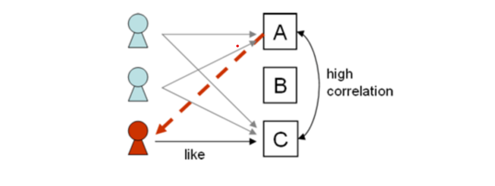
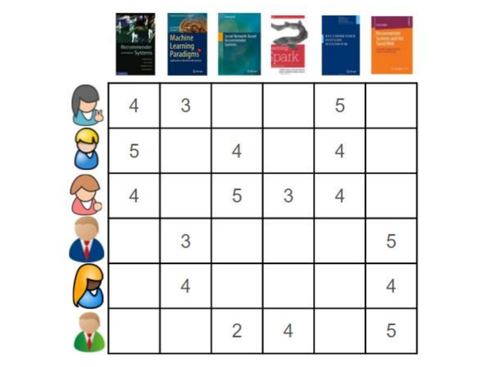
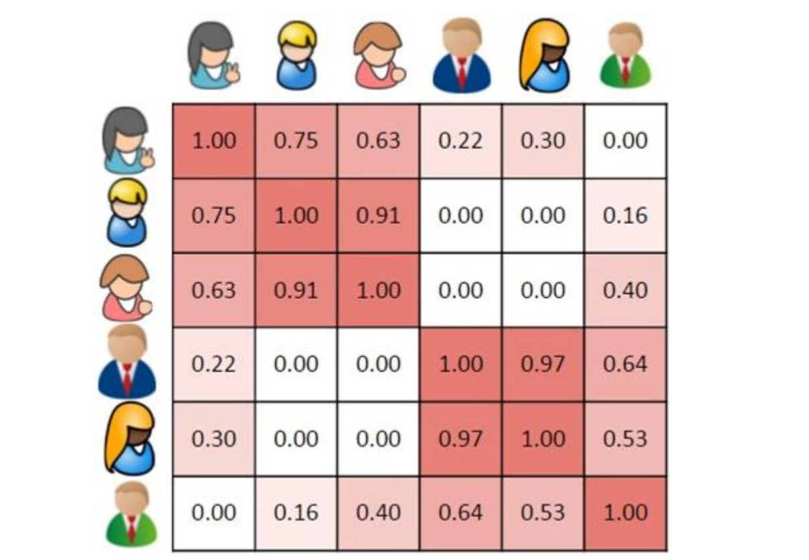
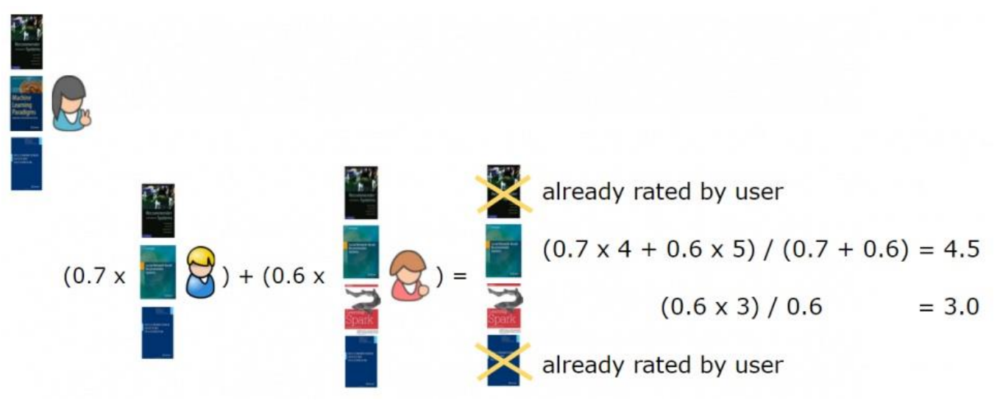
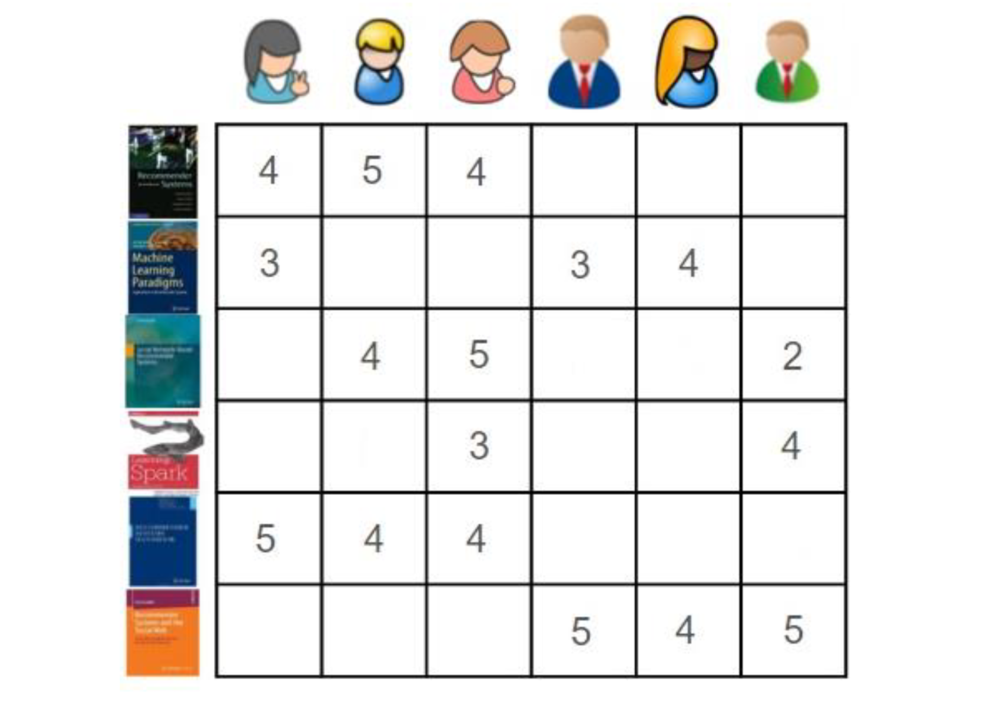
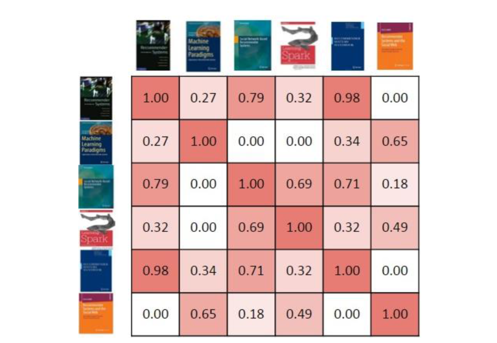
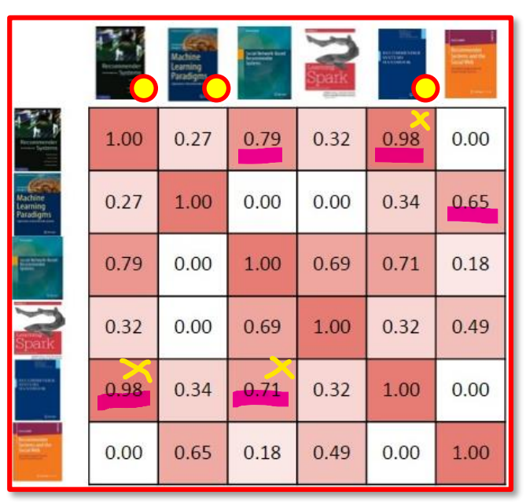
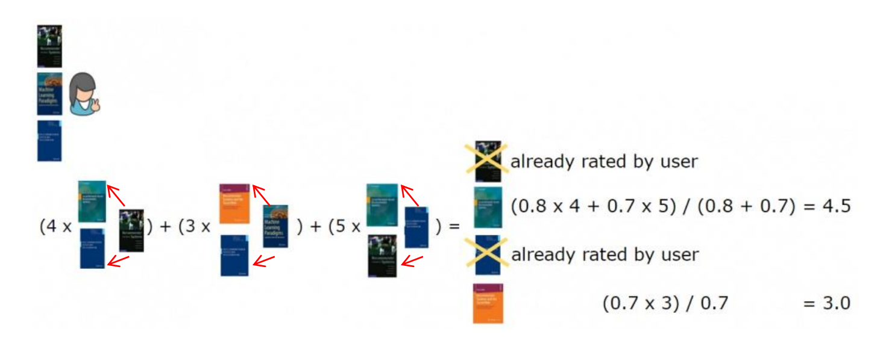

# 機器學習：推薦系統

#  一、概述

推薦系統（Recommender System）的主要目的是根據顧客的喜好進行分析，幫助顧客找
到有用的資訊，或者預測顧客可能會感興趣的商品，並將這些資訊推薦給顧客。而協同過濾
演算（Collaborative Filtering，簡稱 CF）是目前業界開發推薦系統較常運用的一項技術。CF
方法是在找出與目標使者用（Active User）有類似偏好的其他相似使用者（Similar User）

實作協同過濾演算法有 「User-based CF」與「Item-based CF」兩種方式。

## (一) User Base CF 推薦


### - 介紹
 基於使用者的CF的基本思維很簡單，依據顧客對商品的偏好找到相似的鄰居顧客，然後將鄰居顧客喜歡的商品推薦給當前顧客計算上，就是將一個顧客對所有商品的偏好做為一個向量來計算顧客之間的相似度，找到 K 個鄰居後，根據鄰居的相似度權重以及他們對商品的偏好，預測當前顧客沒有偏好的未涉及商品，計算得到一個排序的商品列表做為推薦


### - 基於使用者的協同過濾（UBCF 計算使用者之間的相似度矩陣）：

    1. 計算每個 *使用者與其他使用者之間的相似度*，通常使用「皮爾森相關係數」或「餘弦距離」。

    2. 找出最相近的使用者－近鄰演算法（k Nearest Neighbor, kNN）。

    3. 把新使用者最相似的使用者所購買的商品進行排名。

    4. 基於相似性矩陣選出 n 個推薦的商品。

### - 對於顧客甲，根據顧客的歷史偏好，這裡計算得到一個鄰居-顧客丙，然後將顧客丙喜歡的商品 D 推薦給顧客甲。

| 顧客/商品 | 商品 A | 商品 B | 商品 C | 商品 D |
| :-----: | :----: | :----: | :----: | :----: |
| 顧客甲 | Buy | X | Buy| <div style="background:yellow;color:black;">推薦</div> |
| 顧客乙 | X | Buy | X | X |
| 顧客丙 | Buy | X | Buy | Buy |

```python
import scipy
from scipy.stats import pearsonr
from scipy.spatial.distance import cosine
user1 = [1, 0, 1, 0] #顧客甲購買商品項目
user2 = [0, 1, 0, 0] #顧客乙購買商品項目
user3 = [1, 0, 1, 1] #顧客丙購買商品項目
#計算餘弦距離
print("* 餘弦距離：")
distance = cosine(user1, user2)
print(f"顧客甲 --> 顧客乙(距離)：{distance:1.2f} (相似度)：{1-distance:1.2f}")
distance = cosine(user1, user3)
print(f"顧客甲 --> 顧客丙(距離)：{distance:1.2f} (相似度)：{1-distance:1.2f}")
distance = cosine(user1, user1)
print(f"顧客甲 --> 顧客甲(距離)：{distance:1.2f} (相似度)：{1-distance:1.2f}")
print("="*50)
#計算皮爾森相關係數
# r：相關係數 [-1，1]之間。
# p-value：p 值。p 值越小，表示相關係數越顯著。
print("* 皮爾森相關係數：")
r_row, p_value = pearsonr(user1, user2)
print(f"顧客甲 --> 顧客乙(相似度)：{r_row:1.2f} p 值：{p_value:1.2f}")
r_row, p_value = pearsonr(user1, user3)
print(f"顧客甲 --> 顧客丙(相似度)：{r_row:1.2f} p 值：{p_value:1.2f}")
r_row, p_value = pearsonr(user1, user1)
print(f"顧客甲 --> 顧客甲(相似度)：{r_row:1.2f} p 值：{p_value:1.2f}")

# * 餘弦距離：
# 顧客甲 --> 顧客乙(距離)：1.00 (相似度)：0.00
# 顧客甲 --> 顧客丙(距離)：0.18 (相似度)：0.82
# 顧客甲 --> 顧客甲(距離)：0.00 (相似度)：1.00
# ==================================================
# * 皮爾森相關係數：
# 顧客甲 --> 顧客乙(相似度)：-0.58 p 值：0.42
# 顧客甲 --> 顧客丙(相似度)：0.58 p 值：0.42
# 顧客甲 --> 顧客甲(相似度)：1.00 p 值：0.00

```
## (二) Iten Base CF 推薦

基於商品的 CF 的原理和基於顧客的 CF 類似，只是在 ***計算鄰居時採用商品本身，而不是從顧客的角度*** ，即基於顧客對商品的偏好找到相似的商品，根據顧客的歷史偏
好，推薦相似的商品給他



### - 基於商品的協同過濾（IBCF 計算每個商品之間的相似度矩陣）：

    1. 任意兩個商品計算相似度。
    2. 每一個商品找出其 K 個最相似的商品。
    3. 每一個使用者找出那些商品與其之前購買的商品最接近的商品。

### - 對於商品 A，根據所有顧客的歷史偏好，喜歡商品 A 的顧客都喜歡商品 C，得出商品 A 和商品 C 比較相似，而顧客丙喜歡商品 A，那麼可以推斷出顧客丙可能也喜歡商品 C。

| 顧客/商品 | 商品 A | 商品 B | 商品 C | 
| :-----: | :----: | :----: | :----: | 
| 顧客甲 | Buy | X |  Buy |
| 顧客乙 | Buy | Buy | Buy| 
| 顧客丙 | Buy | X | <div style="background:yellow;color:black;">推薦</div> | 

``` python 
import scipy
from scipy.spatial.distance import cosine
item_A = [1, 1, 1] #商品 A 被哪些顧客購買
item_B = [0, 1, 0] #商品 B 被哪些顧客購買
item_C = [1, 1, 0] #商品 C 被哪些顧客購買
#計算餘弦距離
print("* 餘弦距離：")
distance = cosine(item_A, item_B)
print(f"商品 A --> 商品 B(距離)：{distance:1.2f} (相似度)：{1-distance:1.2f}")
distance = cosine(item_A, item_C)
print(f"商品 A --> 商品 C(距離)：{distance:1.2f} (相似度)：{1-distance:1.2f}")
distance = cosine(item_A, item_A)
print(f"商品 A --> 商品 A(距離)：{distance:1.2f} (相似度)：{1-distance:1.2f}")

# * 餘弦距離：
# 商品 A --> 商品 B(距離)：0.42 (相似度)：0.58
# 商品 A --> 商品 C(距離)：0.18 (相似度)：0.82
# 商品 A --> 商品 A(距離)：0.00 (相似度)：1.00

```

# 二、UBCF 實例

## - 介紹
假設有一組 User（指讀者），他們表現出了對一組 Item（指書籍）的喜好。讀者對一本書籍的喜好程度越高，就會給其更高的評分，範圍是從 1~5。透過一個矩陣來展現，列（row）代表 User（讀者），行（column）代表 Item（書籍）



---
使用 UBCF 方法，首先要做的是依照讀者給書籍做出的評分，計算出讀者之間的相似度。從單一讀者的角度考慮這個問題，做法是將使用包含了 讀者喜好書籍的向量代表每一位讀者喜好。在這個例子中，將使用「餘弦相似度」。當把第一位讀者和其他五位讀者進行比較時，就能直觀地看到他和其他讀者的相似程度。對於大多數相似度量，向量之間相似度越高，代表彼此更相似。本例中，第一位讀者（讀者 1）與兩位其他讀者（讀者 2、3）非常相似，有兩本共同書籍，與另兩位讀者（讀者 4、5）的相似度低一些，只有一本共同書籍，而與最後一位讀者（讀者6）完全不相似，沒有一本共同書籍。

<br>




``` python
import scipy
from scipy.spatial.distance import cosine
reader1 = [4, 3, 0, 0, 5, 0] #讀者 1 對書籍的評分
reader2 = [5, 0, 4, 0, 4, 0] #讀者 2 對書籍的評分
reader3 = [4, 0, 5, 3, 4, 0] #讀者 3 對書籍的評分
reader4 = [0, 3, 0, 0, 0, 5] #讀者 4 對書籍的評分
reader5 = [0, 4, 0, 0, 0, 4] #讀者 5 對書籍的評分
reader6 = [0, 0, 2, 4, 0, 5] #讀者 6 對書籍的評分
#計算餘弦距離
print("* 餘弦距離：")
distance = cosine(reader1, reader1)
print(f"讀者 1 --> 讀者 1 (距離)：{distance:1.2f} (相似度)：{1-distance:1.2f}")
distance = cosine(reader1, reader2)
print(f"讀者 1 --> 讀者 2 (距離)：{distance:1.2f} (相似度)：{1-distance:1.2f}")
distance = cosine(reader1, reader3)
print(f"讀者 1 --> 讀者 3 (距離)：{distance:1.2f} (相似度)：{1-distance:1.2f}")
distance = cosine(reader1, reader4)
print(f"讀者 1 --> 讀者 4 (距離)：{distance:1.2f} (相似度)：{1-distance:1.2f}")
distance = cosine(reader1, reader5)
print(f"讀者 1 --> 讀者 5 (距離)：{distance:1.2f} (相似度)：{1-distance:1.2f}")
distance = cosine(reader1, reader6)
print(f"讀者 1 --> 讀者 6 (距離)：{distance:1.2f} (相似度)：{1-distance:1.2f}")

# * 餘弦距離：
# 讀者 1 --> 讀者 1 (距離)：0.00 (相似度)：1.00
# 讀者 1 --> 讀者 2 (距離)：0.25 (相似度)：0.75
# 讀者 1 --> 讀者 3 (距離)：0.37 (相似度)：0.63
# 讀者 1 --> 讀者 4 (距離)：0.78 (相似度)：0.22
# 讀者 1 --> 讀者 5 (距離)：0.70 (相似度)：0.30
# 讀者 1 --> 讀者 6 (距離)：1.00 (相似度)：0.00
```

## 結論

透過 User-Base 可找出相與目標相似的使用者，設定相似度必須大於0.6，以上述算出結果可找出 <u>讀者1</u> 與 <u>讀者2,3</u> 相似度較高，

我們為 <u>讀者1</u> 進行推薦，先刪除 <u>讀者1</u> 對於 <u>相似的讀者</u> 閱讀過的項目，之後給予相似讀者的項目進行加權計算總和。
### **為一位讀者進行推薦：選取最相似的兩位讀者所評分的書籍，進行加權，然後推薦加權分數最高且目標讀者未評分過的書籍。**
<div style='display:flex !important;justify-content:space-between'>


</div>



# 三、IBCF 實例

## 介紹

基於 ITEM-BASE，需要做的事情也是計算相似矩陣，但與UBCF不同的事，需要關注的item(書籍)、而非User(讀者)的相似性，
<font color='orange'>換言之可理解為矩陣特徵(Column)變為User，關係為書籍對使用者的分數</font>，需要計算出一本書與其他書的相似性，使用評分過的一本屬的讀者向量表示這本書籍，並比較這些向量餘弦的相似性。

>由下面的相似矩陣,可以看出第一本書最類似第五本書





```python
import scipy
from scipy.spatial.distance import cosine

book1 = [4, 5, 4, 0, 0, 0] #書籍 1 讀者給的評分
book2 = [3, 0, 0, 3, 4, 0] #書籍 2 讀者給的評分
book3 = [0, 4, 5, 0, 0, 2] #書籍 3 讀者給的評分
book4 = [0, 0, 3, 0, 0, 4] #書籍 4 讀者給的評分
book5 = [5, 4, 4, 0, 0, 0] #書籍 5 讀者給的評分
book6 = [0, 0, 0, 5, 4, 5] #書籍 6 讀者給的評分
#計算餘弦距離
print("* 餘弦距離：")
distance = cosine(book1, book1)
print(f"書籍 1 --> 書籍 1 (距離)：{distance:1.2f} (相似度)：{1-distance:1.2f}")
distance = cosine(book1, book2)
print(f"書籍 1 --> 書籍 2 (距離)：{distance:1.2f} (相似度)：{1-distance:1.2f}")
distance = cosine(book1, book3)
print(f"書籍 1 --> 書籍 3 (距離)：{distance:1.2f} (相似度)：{1-distance:1.2f}")
distance = cosine(book1, book4)
print(f"書籍 1 --> 書籍 4 (距離)：{distance:1.2f} (相似度)：{1-distance:1.2f}")
distance = cosine(book1, book5)
print(f"書籍 1 --> 書籍 5 (距離)：{distance:1.2f} (相似度)：{1-distance:1.2f}")
distance = cosine(book1, book6)
print(f"書籍 1 --> 書籍 6 (距離)：{distance:1.2f} (相似度)：{1-distance:1.2f}")
* 餘弦距離：
# 書籍 1 --> 書籍 1 (距離)：0.00 (相似度)：1.00
# 書籍 1 --> 書籍 2 (距離)：0.73 (相似度)：0.27
# 書籍 1 --> 書籍 3 (距離)：0.21 (相似度)：0.79
# 書籍 1 --> 書籍 4 (距離)：0.68 (相似度)：0.32
# 書籍 1 --> 書籍 5 (距離)：0.02 (相似度)：0.98
# 書籍 1 --> 書籍 6 (距離)：1.00 (相似度)：0.00
```
透過書籍之間的相似性，可得出一位讀者所評分過的書籍與其他書籍的相關性，再以此進行推薦，以第一位使用者為例，評分過的書為第一、二、五本，透過書籍之間的相似矩陣，扣除重複推薦與已經評分過的，可以推薦第一位讀者第三本、第六本




### **為讀者進行推薦：選取他們評分過的書籍，找出與它們最相似的前兩本書籍，進行加權，然後推薦給讀者加權分最高且他沒有讀過的書籍**
<div style='display:flex !important;justify-content:space-between'>


</div>


基於 User 和基於 Item 的協同過濾的描述聽起來非常相似，但是它們可以產生不同的推薦結果。即使在這裡給出的簡易的例子中，使用的數據相同，這兩種方法產生對於同一 User 產生的推薦結果也不相同。當構建推薦系統的時候，這兩種協同
過濾方式都是值得考慮的，在實踐中，他們可以產生不同的結果，為 User 提供了不同的體驗。

## 小結

- 當客戶群體很大時，使用userBase進行分析，相似矩陣會非常龐大，可使用itembase進行計算會比較快速，抑或是以天數的方式更新相似矩陣作為模型保存(目前實務上有用到的方法)，相反若商品為主的系統，可使用userBase加速運算，或是使用上述保存模型的方式避免計算耗時

- UserBase CF 容易推薦最多使用者關聯購買的項目，可以理解為推薦的項目可能都會是熱銷商品，若希望挖掘一些非熱銷但高關聯的產品可以考慮使用ItemBase，可能比較有機會關聯出平常不顯著的商品

- 實務上在系統剛上正式，可能會遇到冷啟動的問題，USER初始資料匱乏，或剛推出的項目沒有點擊記錄之類的，這也是必須考量的項目


# 二 推薦系統範例