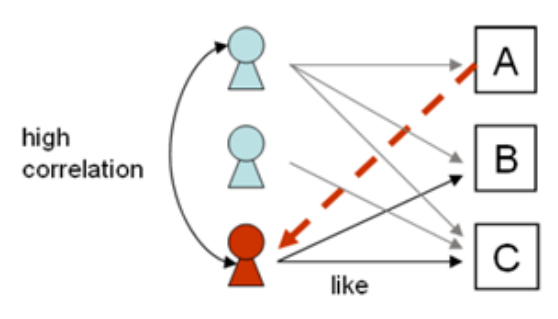

# 機器學習：推薦系統
推薦系統（Recommender System）的主要目的是根據顧客的喜好進行分析，幫助顧客找
到有用的資訊，或者預測顧客可能會感興趣的商品，並將這些資訊推薦給顧客。而協同過濾
演算（Collaborative Filtering，簡稱 CF）是目前業界開發推薦系統較常運用的一項技術。CF
方法是在找出與目標使者用（Active User）有類似偏好的其他相似使用者（Similar User）

實作協同過濾演算法有 「User-based CF」與「Item-based CF」兩種方式。

## (一) 、User Base CF 推薦

<br>


> 基於使用者的CF的基本思維很簡單，依據顧客對商品的偏好找到相似的鄰居顧客，然後將鄰居顧客喜歡的商品推薦給當前顧客

<br>

計算上，就是將一個顧客對所有商品的偏好做為一個向量來計算顧客之間的相似度，找到 K 個鄰居後，根據鄰居的相似度權重以及他們對商品的偏好，預測當前顧客沒有偏好的未涉及商品，計算得到一個排序的商品列表做為推薦



##  基於使用者的協同過濾（UBCF 計算使用者之間的相似度矩陣）：


1. 計算每個使用者與其他使用者之間的相似度，通常使用「皮爾森相關係數」或「餘弦距離」。

2. 找出最相近的使用者－近鄰演算法（k Nearest Neighbor, kNN）。

3. 把新使用者最相似的使用者所購買的商品進行排名。

4. 基於相似性矩陣選出 n 個推薦的商品。


| 顧客/商品 | 商品 A | 商品 B | 商品 C | 商品 D |
| :-----: | :----: | :----: | :----: | :----: |
| 顧客甲 | * | 单元格 | * | <div style="background:yellow;color:black;">推薦</div> |
| 顧客乙 | 单元格 | 单元格 | 单元格 | 单元格 |
| 顧客丙 | 单元格 | 单元格 | 单元格 | 单元格 |

```python
import scipy
from scipy.stats import pearsonr
from scipy.spatial.distance import cosine
user1 = [1, 0, 1, 0] #顧客甲購買商品項目
user2 = [0, 1, 0, 0] #顧客乙購買商品項目
user3 = [1, 0, 1, 1] #顧客丙購買商品項目
#計算餘弦距離
print("* 餘弦距離：")
distance = cosine(user1, user2)
print(f"顧客甲 --> 顧客乙(距離)：{distance:1.2f} (相似度)：{1-distance:1.2f}")
distance = cosine(user1, user3)
print(f"顧客甲 --> 顧客丙(距離)：{distance:1.2f} (相似度)：{1-distance:1.2f}")
distance = cosine(user1, user1)
print(f"顧客甲 --> 顧客甲(距離)：{distance:1.2f} (相似度)：{1-distance:1.2f}")
print("="*50)
#計算皮爾森相關係數
~ 5 ~
# r：相關係數 [-1，1]之間。
# p-value：p 值。p 值越小，表示相關係數越顯著。
print("* 皮爾森相關係數：")
r_row, p_value = pearsonr(user1, user2)
print(f"顧客甲 --> 顧客乙(相似度)：{r_row:1.2f} p 值：{p_value:1.2f}")
r_row, p_value = pearsonr(user1, user3)
print(f"顧客甲 --> 顧客丙(相似度)：{r_row:1.2f} p 值：{p_value:1.2f}")
r_row, p_value = pearsonr(user1, user1)
print(f"顧客甲 --> 顧客甲(相似度)：{r_row:1.2f} p 值：{p_value:1.2f}")

```
