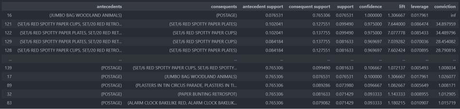

# 條件機率

P(B|A) : `已知A發生的條件下` ， 另一件事情B發生的機率。 資料集由母群變成 `已發生事件的A群體`


#### 以撲克牌的例子說明：

假設 A = 「抽出紅色的卡牌」，B = 「抽出數字 4 的卡牌」

則 P(B | A) = 2/26 (因為已經先抽出 26 張紅色的卡牌，其中包含兩張數字 4)。


# 聯合機率

P(A,B) or P(A ∩ B): 「聯合機率」(Joint Probability) 指的是「兩個或多個」事件同時發生的機率。A 與 B 是兩個不同的事件，A 與 B 同時發生的機率為

#### 以撲克牌的例子說明：

假設 A =「從一副撲克牌中抽出一張 6」且 B =「從一副撲克牌中抽出一張紅色」，則 P(A ∩ B) = 2/52 (因為一副撲克牌有 52 張，同時是 6 又是紅色的有 2 張)。

# 條件機率 vs 聯合機率

#### 繼續前面撲克牌的例子:

假設我們希望計算「抽出一張紅色卡牌且為數字 4」的機率，此機率就是聯合機率，可以表示為 P(Red and 4) = P(Red ∩ 4)。要計算這一個聯合機率，我們可以想像現在桌面上擺放著 52 張撲克牌，而且這些撲克牌都是「蓋上」的，因此我們不知道每張撲克牌實際的顏色與數字。但是，我們知道這 52 張卡牌中，顏色是紅色且數字為 4 的卡牌有 2 張。因此，P(Red and 4) = 2/52。

另外一種情況，假設我們希望計算「抽出一張數字為 4 的卡牌，且已經知道他是紅色」的機率，此機率就是條件機率，可以表示為 P(4 | Red)。要計算這一個條件機率，我們可以想像桌面上擺放著所有的 52 張撲克牌，但是抽出卡牌之前，我們已經事先將所有紅色的卡牌取出，並且攤開在桌上。又 26 張紅色的卡牌中，包含了 2 張數字 4 的卡牌。因此 P(4 | Red) = 2/26 = 1/13。

此外，我們也可以透過乘法法則 (Multiplication Rule) 計算上述的問題。以聯合機率 P(Red and 4) 為例，P(Red and 4) = P(4 and Red) 會等於 P(4 | Red) × P(Red) = 1/13 × 1/2 = 1/26 = 2/52。

補充：P(Red) = 1/2，因為 52 張撲克牌中有一半是紅色的！

---------------------------------------------------------------------------------------------------------------------------------


# 關聯分析

> 一般我們在進行商務資料分析時，總是會期望能透過過往所獲得的資料來發掘更多的商業洞察。一般店家在進行銷售的同時，也會留下顧客的銷售清單，而若該廠商有採用會員制度，更可以將銷售資料與顧客的個人資料做串連。在此，使用兩個資料分析的觀念：「關聯規則」與「協同過濾」，透過這兩種技術，我們皆能從過往的銷售資料中，抓取出重要的關鍵資訊，並能以此作為商品品項推薦的基礎，協助我們做出管理決策。

在銷售時我們不見在所有情境下都能鎖定消費者是誰，比如在大賣場會便利商店購物並沒有機會留下會員資料 ex:只有每一張發票的消費紀錄，在這種情況下可以透過關聯分析，也稱做購物車分析來做推薦


# 關聯分析評估指標

## 支持度(Support) = P(X,Y) : 

> 聯合概率 X,Y 同時出現的機率

> 衡量前提項x 與結果項 y 一起出現的機率，表示該規則在全部交易中出現的比率


## 信心度(Confidence) = P(X|Y) = P(X,Y)/P(X): 

> 在 Y 條件下 X 出現的機率，即已發生事件Y的條件下發生X的機率

> 表示規則的信心程度，在前題項x發生的情況下，結果項y發生的條件機率

## 增益 (Lift) = P(X|Y)/P(Y):

### 裡有一個很好的例子 : https://ithelp.ithome.com.tw/articles/10200936

> 用於比較信賴度結果與單獨項目兩者發生機率大小

> 若值越>1表示關聯性越強

``` python

from mlxtend.preprocessing import TransactionEncoder
from mlxtend.frequent_patterns import apriori
from mlxtend.frequent_patterns import  association_rules
import pandas as pd

# 一、購買清單
dataSet = [['Milk','Onion','Nutmeg','Kidney Beans','Eggs','Yogurt'],
            ['Dill','Onion','Nutmeg','Kidney Beans','Eggs','Yogurt'],
            ['Milk','Apple','Kidney Beans','Eggs'],
            ['Milk','Unicorn','Corn','Kidney Beans','Yogurt'],
            ['Corn','Onion','Onion','Kidney Beans','Ice cream','Eggs']]
            
# 二、轉換為模型可接受資料
te = TransactionEncoder()
te_ary = te.fit(dataSet).transform(dataSet)

print(te_ary)
print(te.columns_)

'''
[[False False False  True False  True  True  True  True False  True]
 [False False  True  True False  True False  True  True False  True]
 [ True False False  True False  True  True False False False False]
 [False  True False False False  True  True False False  True  True]
 [False  True False  True  True  True False False  True False False]]

['Apple', 'Corn', 'Dill', 'Eggs', 'Ice cream', 'Kidney Beans', 'Milk', 'Nutmeg', 'Onion', 'Unicorn', 'Yogurt']
'''
df = pd.DataFrame(te_ary,columns=te.columns_)

# 三、計算頻繁項目集 min_support 最小頻繁閥值
frequent_items = apriori(df,min_support=0.6,use_colnames=True)

# 新增一個物品長度欄位
# 資料很多時，購買長度>2 & 支持度(出線機率) 高於一個閥值才有意義
# 由於這個例子資料較少，不特別做篩選
frequent_items['length'] = frequent_items['itemsets'].apply(lambda x:len(x))


# 四、計算關聯規則
ass_df = association_rules(frequent_items,metric='lift',min_threshold = 0.2)

#預測
# tips type(ass_df) 為 frozenset 比對時須以 {} 包裝比較值
ass_df[ass_df['antecedents'] == {'Milk'}]
```

## 心得

- Apriori 若商品種類很多運算量過大時，可考慮以時間區間(一季、半年...等等)抓取資料，運算後保存模型，或是減少運的種類

- 做關聯規則時，需綜合考慮Support、Confidence、Lift，支持度與信賴度越高則越好

- 提升度負相關也是一種關聯模式，可利用這關聯避免將互斥產品放在同一個組合，例如: 不將互斥關鍵字、互斥資訊..等資訊投放給顧客

## 應用

+ 網頁或系統關聯分析 : 可記錄大數據網頁點擊或系統點擊的紀錄，分析頻繁來往的網頁關係，可得到使用者特定頁面的瀏覽方式，了解不同頁面間的分流情況，可推薦相關的系統或頁面

+ 使用者關鍵字搜尋 : 可紀錄網站內搜尋的關鍵字，瞭解使用者搜尋的真實需求，透過對使用者搜尋的關鍵字關聯分析，可以得到類似搜尋 'iphone' 也搜尋 'samsung'的結果，這種關聯可用於搜尋時的推薦、搜尋結果的關聯...等等，有助於改善搜尋體驗，提高目標的黏著度與轉化

+ 不同的場景發生，這種模式可以廣泛用於分析營運中關注的要素，例如使用者瀏覽商品和購買商品的關聯，關注產品價格和購買產品價格的關聯，加入購物車與購買的關聯等等。這種關聯可以找到使用者在一個事件中不同的行為之間的關離

+ 相同的場景發生，使用者在同一頁點選不同的功能，這種關聯可以分析使用者功能的先後順序，有利於產品優化和使用者體驗提升，針對習慣性操作模或使用者頻繁檢是何點選的內容，可以採用打包、組合、輪轉等策略


------------------------------------------------------------------------------------------------------------------------------------------

# 關聯分析 2

> 使用2010~2011 英國零售商交易資料進行分析

## 資料整理 

+ 數據處理，交易紀錄描述資料可能會有前後空白，可透過DataFrame取欄位.str.strip()指定前後要排除的字眼

+ 分析時刪除發票編號包含C的單據，可使用str.contains('C')找到包含 C 的單據再透過 ~ 反轉搜尋結果

```python
  from mlxtend.frequent_patterns import apriori
  from mlxtend.preprocessing import TransactionEncoder
  from mlxtend.frequent_patterns import  association_rules
  import pandas as pd
  df = pd.read_excel('./Online_Retail.xlsx')

  df.dropna(axis=0,subset=['InvoiceNo'],inplace=True)
  df['Description'] = df['Description'].str.strip()
  df['InvoiceNo'] = df['InvoiceNo'].astype('str')
  df = df[~df['InvoiceNo'].str.contains('C')]
```

+ 透過groupby依據 **單據號碼** 與 **產品描述** 計算 **數量**

+ groupby 完後會依具索引產生Series，透過unstack()轉換為DataFrame

+ Series['inedx'] => 帶出該row 的資料

+ DataFrame['ColumnName'] => 帶出該Column的資料

+ apriori 需傳入Dataframe ，groupby 完後須unstack()再傳入

+ 購物籃分析無須考慮數量 ，透過**encode_units** 將數量轉為1、0


``` python

  basket = df[df['Country'] == "France"].groupby(['InvoiceNo','Description'])['Quantity'].sum().unstack().fillna(0)
  def encode_units(x):
      if x <= 0:
          return 0
      if x >= 1:
          return 1

  # map僅在Series(係列)上定義
  # applymap僅在DataFrame上定義
  basket_sets = basket.applymap(encode_units)
  fre = apriori(basket_sets,min_support=0.07,use_colnames=True)
  rules = association_rules(fre,metric='lift',min_threshold=1)
  rules = rules.sort_values('lift',ascending = False)
  rules.head()

```
lift 正相關性高只代表兩者組合性強，不代表是熱銷商品，所以不只要找到高關聯性的商品，還要找會熱銷的商品推薦給顧客


